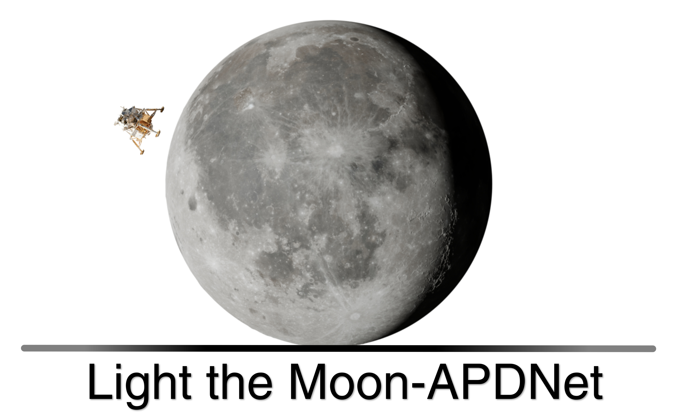
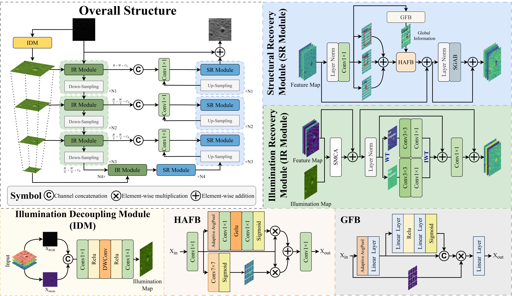

<p align="center"> 

# Light the Moon: Asymmetric Physics-Guided Dual-Domain Network for Low-Light Enhancement of Lunar Shadowed Regions

## Abstract

Images acquired in lunar permanently shadowed regions (PSRs) typically exhibit insufficient brightness, severe noise, and degradation of structural details, which are detrimental to lunar poler oriented exploration tasks. Existing enhancement approaches are limited by the absence of physically imaging constraints and real PSR datasets. To address these challenges, we propose an asymmetric physics-guided dual-domain network (APDNet), which decomposes the PSR enhancement task into three stages—illumination decoupling, illumination restoration, and structure restoration. The asymmetric architecture allows us to perform task-oriented enhancements for different modules according to their respective subtasks. Specifically, a frequency-domain processing mechanism is introduced to achieve spectral supervision for illumination restoration. Global and local latent information is processed in parallel and fused to restore degraded textures.  Furthermore, we construct the first paired low-light lunar PSR image dataset to facilitate model training and evaluation. Experimental results demonstrate that the proposed method achieves state-of-the-art enhancement performance on the PSR dataset and exhibits comparable restoration ability to the currently best methods on prevailing low-light datasets.

## Overview

<p align="center"> 
    

## 1. Create Environment


### 1.1 Install the training environment

- Make Conda Environment
``` shell
conda create -n APDNet python=3.9 -y
conda activate APDNet
```

- Install Dependencies
``` shell
conda install pytorch torchvision torchaudio pytorch-cuda=11.8 -c pytorch -c nvidia

pip install matplotlib scikit-learn scikit-image opencv-python yacs joblib natsort h5py tqdm tensorboard

pip install einops gdown addict future lmdb numpy pyyaml requests scipy yapf lpips thop timm
```

### 1.2 Install the testing environment
- Make Conda Environment
``` shell
conda create -n caculate python=3.9 -y
conda activate caculate
```

- Install Dependencies
``` shell
pip install -r caculate_requirements.txt
```

## 2. Prepare Dataset
Download the following datasets. For the general dataset, we directly used the publicly available data from Retinexformer and URWKV.

PSR low-light datasets: [Google Drive](https://drive.google.com/drive/folders/1TAzALGR3dYn_ULrIhy7hmI0IgZapyLxH?usp=drive_link)

Zhang's PSR image data: [Github](https://github.com/dl-zfq/PSR_Enhancement)

General datasets (LOLv2 and et al.): [Retinexformer's github page](https://github.com/caiyuanhao1998/Retinexformer), [URWKV's github page](https://github.com/FZU-N/URWKV)


## 3. Testing

### 3.1 Paired datasets

Please find the **YAML file** for the corresponding dataset in the **./config/** folder, and put the path of the dataset into the **YAML file**. In the **predict.py** file, put the paths of the **weight file** and the **YAML file** in the corresponding positions in args, then use the following command:
``` shell
conda activate APDNet
python predict.py
```
Or directly type the following code in the command line:
``` shell
python predict.py --weights your_weights_path --yml_path your_yaml_file_path
```
### 3.2 Un-paired datasets
The testing method for unpaired datasets is the same as that for paired datasets. Calculating metrics for unpaired datasets requires switching the conda environment, and put your **image folder path** into the **experiment.py**file
``` shell
# Calculating metrics:
conda activate caculate
python experiment.py
```
## 4. Training
Please find the **YAML file** for the corresponding dataset in the **./config/** folder, and put the path of the dataset into the **YAML file**. In the **train.py** file, put the paths of the **weight file** and the **YAML file** in the corresponding positions in args, then use the following command:

``` shell
# Single GPU Training
conda activate APDNet
CUDA_VISIBLE_DEVICES=n python train.py # n is the GPU number you selected
```
If you need to train using multiple GPUs, please use the following command:
``` shell
# Multi GPU Training
conda activate APDNet
CUDA_VISIBLE_DEVICES=0,1,...,n1 python -m torch.distributed.launch --nproc_per_node=n --use_env train.py # n how many GPUs you selected

# For example, if you want to train the model using GPUs numbered 0, 1, 2, and 3:
CUDA_VISIBLE_DEVICES=0,1,2,3 python -m torch.distributed.launch --nproc_per_node=4 --use_env train.py
```

## Our results
Comming soon.